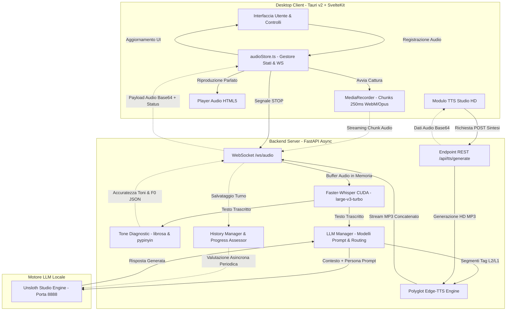
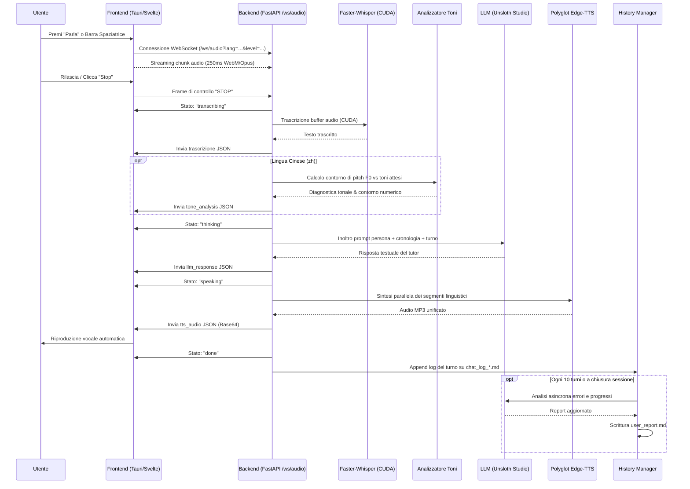

# English Buddy 🎙️🤖

**English Buddy** è un'applicazione desktop open source, locale e orientata alla privacy, progettata come assistente e tutor conversazionale avanzato per l'apprendimento delle lingue (Inglese e Cinese Mandarino).

Combina un'interfaccia reattiva in **Tauri v2 + SvelteKit** con una pipeline di intelligenza artificiale locale ad alte prestazioni in **FastAPI**, integrando riconoscimento vocale istantaneo (ASR), modelli linguistici locali (LLM), diagnostica fonetica dei toni con tracciamento della frequenza fondamentale (F0) e sintesi vocale neurale multilingue (TTS).

---

## Indice

- [Panoramica e Funzionalità Principali](#panoramica-e-funzionalità-principali)
- [Architettura di Sistema](#architettura-di-sistema)
  - [Pipeline Conversazionale in Tempo Reale](#pipeline-conversazionale-in-tempo-reale)
- [Scelte Architetturali e Motivazioni Tecniche](#scelte-architetturali-e-motivazioni-tecniche)
  - [1. Frontend Desktop: Tauri v2 + SvelteKit](#1-frontend-desktop-tauri-v2--sveltekit)
  - [2. Streaming Audio Bidirezionale su WebSockets](#2-streaming-audio-bidirezionale-su-websockets)
  - [3. Riconoscimento Vocale (ASR): Faster-Whisper su CUDA](#3-riconoscimento-vocale-asr-faster-whisper-su-cuda)
  - [4. Intelligenza Linguistica: LLM Locale con Unsloth Studio](#4-intelligenza-linguistica-llm-locale-con-unsloth-studio)
  - [5. Diagnostica Fonetica dei Toni Cinesi: F0 Pitch Tracking](#5-diagnostica-fonetica-dei-toni-cinesi-f0-pitch-tracking)
  - [6. Sintesi Vocale Poliglotta Asincrona: Edge-TTS](#6-sintesi-vocale-poliglotta-asincrona-edge-tts)
  - [7. Studio Generatore Audio HD per Hanzi e Pinyin](#7-studio-generatore-audio-hd-per-hanzi-e-pinyin)
  - [8. Monitoraggio Progressi e Persistenza Asincrona a Due Livelli](#8-monitoraggio-progressi-e-persistenza-asincrona-a-due-livelli)
  - [9. Gestione Centralizzata della Configurazione (Pydantic Settings)](#9-gestione-centralizzata-della-configurazione-pydantic-settings)
- [Struttura del Progetto](#struttura-del-progetto)
- [Requisiti di Sistema](#requisiti-di-sistema)
- [Avvio Rapido](#avvio-rapido)
  - [Script di Avvio Unificato (`start_app.sh`)](#script-di-avvio-unificato-start_appsh)
  - [Avvio Manuale dei Componenti](#avvio-manuale-dei-componenti)
- [Configurazione e Personalizzazione](#configurazione-e-personalizzazione)
- [Test e Controllo Qualità](#test-e-controllo-qualità)
- [Documentazione Aggiuntiva](#documentazione-aggiuntiva)

---

## Panoramica e Funzionalità Principali

- **Conversazione Vocale Naturale**: Pratica guidata o libera in lingua inglese o cinese con feedback correttivo immediato e interazione a bassa latenza.
- **Tutor Multilivello**:
  - 🎓 *Principiante*: Spiegazioni grammaticali e fonetiche con supporto in lingua italiana, scomposizione in Pinyin e correzione dei toni.
  - 🗣️ *Intermedio*: Dialoghi bilingui bilanciati con suggerimenti lessicali.
  - 🚀 *Avanzato*: Immersione totale nella lingua target con correzioni stilistiche e arricchimento idiomatico.
- **Analisi dei Toni del Mandarino**: Estrazione del contorno di intonazione dell'utente confrontato in tempo reale con i 4 toni canonici del cinese mandarino.
- **Studio Audio HD (Pinyin & Hanzi)**: Generazione istantanea di parlato ad alta definizione per caratteri Hanzi e Pinyin (con accenti o numeri di tono), con player integrato e download locale del file MP3.
- **Privacy Totale**: Il riconoscimento vocale e il modello linguistico vengono eseguiti interamente in locale senza invio di dati biometrici vocali a server cloud terzi.
- **Report Continuo dei Progressi**: Tracciamento incrementale degli errori ricorrenti, delle competenze acquisite e degli obiettivi di studio tramite report persistenti in formato Markdown.

---

## Architettura di Sistema

English Buddy adotta un'architettura disaccoppiata client-server: il frontend desktop gestisce l'interfaccia utente, l'acquisizione microfonica e la riproduzione audio, mentre il backend FastAPI orchestra l'elaborazione dei flussi, le pipeline neurali e la persistenza dei dati.



### Pipeline Conversazionale in Tempo Reale

Ogni turno conversazionale attraversa una sequenza a stati notificata in tempo reale al client:



---

## Scelte Architetturali e Motivazioni Tecniche

Le decisioni tecnologiche e architetturali del progetto sono state guidate da tre priorità: **latenza conversazionale ridotta al minimo**, **completa privacy dei dati dell'utente** e **robustezza nell'ambiente desktop Linux/KDE**.

### 1. Frontend Desktop: Tauri v2 + SvelteKit

- **Tauri v2 (Rust)**:
  - *Perché non Electron?* Electron include un intero runtime Chromium e Node.js per finestra, portando il consumo di RAM a oltre 300–400 MB anche a riposo e aumentando il peso dei binari a oltre 150 MB. Tauri sfrutta le Webview native del sistema operativo e un backend compatto in Rust: l'applicazione occupa solo ~15–20 MB di RAM all'avvio e offre una sicurezza granulare (ACL) su capacità del filesystem e dialog nativi.
  - *Integrazione Filesystem Nativa*: Mediante `@tauri-apps/plugin-dialog` e `@tauri-apps/plugin-fs`, l'utente può selezionare percorsi di salvataggio nativi (ad es. `/home/simone/Musica/Sounds/`) per esportare i file MP3 senza passare dai download sandboxati del browser.
- **SvelteKit + TypeScript + TailwindCSS**:
  - *Perché SvelteKit?* Svelte compila i componenti in codice JavaScript vanilla altamente ottimizzato senza l'overhead del Virtual DOM presente in React o Vue. Questo garantisce reattività istantanea ai segnali di stato audio e aggiornamenti dell'interfaccia a 60 fps.
- **Microfono e Compatibilità Linux (PipeWire / WebKitGTK)**:
  - L'uso di vincoli audio rigidi (`exact`) in `getUserMedia` provocava asserzioni critiche in GStreamer (`range start is not smaller than end for GstIntRange`) su distribuzioni Linux con PipeWire/PulseAudio. L'architettura è stata aggiornata per utilizzare vincoli indicativi (`ideal: 16000`, `ideal: 1`), risolvendo alla radice i crash del processo WebKit.

### 2. Streaming Audio Bidirezionale su WebSockets

- *Perché WebSockets rispetto al tradizionale polling o POST HTTP?*
  L'interazione vocale richiede un ciclo continuo e a bassa latenza. Con un singolo canale WebSocket persistente (`/ws/audio`):
  1. I chunk audio vengono inviati in streaming man mano che l'utente parla (fette temporali da 250ms), riducendo a zero il tempo di upload a fine frase.
  2. Il server invia notifiche di stato transitorie immediate (`transcribing`, `thinking`, `speaking`, `done`) senza overhead di handshake HTTP multipli.
  3. L'audio sintetizzato in risposta viene restituito come payload Base64 nello stesso flusso logico, semplificando la sincronizzazione con il player frontend.
- *Bufferizzazione in Memoria*: Il backend accumula i chunk audio in un `io.BytesIO` in RAM. Questo elimina la latenza di lettura/scrittura su disco rigido o SSD e previene il degrado dei dispositivi di archiviazione durante sessioni prolungate.

### 3. Riconoscimento Vocale (ASR): Faster-Whisper su CUDA

- *Perché `faster-whisper` (`large-v3-turbo`)?*
  - Rispetto all'implementazione standard di OpenAI Whisper su PyTorch, `faster-whisper` sfrutta il motore di inferenza **CTranslate2**, offrendo un'accelerazione fino a **4x** con un'efficienza di memoria VRAM significativamente superiore.
  - Il modello `large-v3-turbo` garantisce un'accuratezza eccezionale nel riconoscimento di accenti complessi, parlato rapido ed esitazioni tipiche degli studenti di lingue, completando la trascrizione in frazioni di secondo su GPU NVIDIA (quantizzazione `int8_float16`).

### 4. Intelligenza Linguistica: LLM Locale con Unsloth Studio

- *Perché un LLM in esecuzione locale?*
  - **Privacy e Riservatezza**: I dati della voce e delle trascrizioni non escono mai dal dispositivo dell'utente.
  - **Zero Costi di Inferenza**: Nessuna spesa di abbonamento API cloud o limite di token per minuto.
  - **Latenza Prevedibile e Bassa**: Collegamento diretto via loopback HTTP (`http://127.0.0.1:8888/v1`) al server locale Unsloth Studio / vLLM eseguendo modelli ottimizzati come `unsloth/Qwen3-8B-GGUF:UD-Q4_K_XL`.
- *Modularità dei Prompt Persona*:
  - I prompt di sistema non sono cablati nel codice sorgente Python, ma risiedono in file Markdown dedicati (`backend/app/core/prompts/`). Questo consente a docenti o sviluppatori di perfezionare la pedagogia, le correzioni e il tono del tutor senza riavviare o ricompilare il codice.
- *Filtraggio dei Token di Ragionamento*:
  - Nei modelli moderni con capacità di reasoning (come Qwen o DeepSeek), i tag `<think>...</think>` vengono intercettati e rimossi dalla risposta inviata allo studente, preservando solo il messaggio conversazionale pulito.

### 5. Diagnostica Fonetica dei Toni Cinesi: F0 Pitch Tracking

- *Perché l'analisi F0 dedicata?*
  Il cinese mandarino è una lingua tonale in cui il profilo di intonazione definisce il significato della parola. Gli ASR convenzionali trascrivono solo il testo senza fornire feedback sulla correttezza tonale.
- *Pipeline con `librosa` e `pypinyin`*:
  1. La trascrizione viene convertita nei toni attesi (Tono 1: piatto alto, Tono 2: ascendente, Tono 3: discendente-ascendente, Tono 4: discendente, Tono 5: neutro).
  2. `librosa` estrae la traiettoria della frequenza fondamentale (F0 contour) dai frame vocalizzati del segnale audio.
  3. Il backend confronta la pendenza e il contorno registrato con i modelli fonetici standard, calcolando una percentuale di accuratezza e inviando i dati numerici al frontend per la visualizzazione immediata.

### 6. Sintesi Vocale Poliglotta Asincrona: Edge-TTS

- *Perché Edge-TTS rispetto a modelli TTS locali su GPU?*
  I modelli TTS neurali locali di alta qualità (come XTTSv2 o Bark) richiedono diversi gigabyte di VRAM e cicli di calcolo intensivi su GPU, entrando in competizione diretta con Whisper e con il modello LLM. `edge-tts` offre voci neurali di qualità paragonabile a voci umane, con latenza di streaming minima e impatto zero sulla memoria VRAM della GPU.
- *Sintesi Poliglotta Parallela Concorrente*:
  Nelle sessioni con tutor bilingue (es. spiegazione in italiano con frase di esempio in cinese), il backend analizza i tag di lingua (`<it>...</it>`, `<zh>...</zh>`) ed esegue la sintesi vocale in parallelo tramite `asyncio.gather` assegnando ciascun segmento alla voce nativa corretta (`zh-CN-XiaoxiaoNeural`, `it-IT-ElsaNeural`). I flussi MP3 vengono concatenati in memoria in un unico file continuo prima della riproduzione.
- *Standardizzazione dei Parametri*:
  Tutti i parametri di intonazione (`pitch`) sono rigorosamente normalizzati in Hertz (`+0Hz`) e la velocità (`rate`) in percentuali (`+0%`, `-20%`), prevenendo errori di sintesi.

### 7. Studio Generatore Audio HD per Hanzi e Pinyin

- Consente di inserire sia caratteri cinesi (Hanzi) che notazione Pinyin (compreso Pinyin con numeri di tono come `ni3 hao3` o vocali tonali con diacritici).
- La funzione `pinyin_numbered_to_tone` converte automaticamente le notazioni numeriche (es. `lv4` o `lu:4` in `lǜ`) garantendo la perfetta pronuncia da parte del motore neurale.
- Offre selettori di velocità e tono, anteprima immediata e salvataggio del file MP3 direttamente sul disco locale.

### 8. Monitoraggio Progressi e Persistenza Asincrona a Due Livelli

- **Livello 1: Logging di Sessione Incrementale (Append-Only)**:
  Ogni turno conversazionale viene scritto immediatamente su un file di log Markdown (`user_history/sessions/chat_log_*.md`). In caso di interruzione improvvisa o crash di rete, nessun dato o trascrizione va perduto.
- **Livello 2: Valutazione Periodica in Background (Non-Bloccante)**:
  L'analisi dettagliata degli errori grammaticali, lessicali e fonetici viene affidata all'LLM locale come task in background eseguito ogni 10 turni e alla chiusura della sessione. Questo garantisce che la valutazione non rallenti né blocchi la fluidità del dialogo vocale.

### 9. Gestione Centralizzata della Configurazione (Pydantic Settings)

- La configurazione applicativa risiede esclusivamente in [`backend/app/core/config.py`](backend/app/core/config.py), ereditando da `pydantic_settings.BaseSettings`.
- Costituisce l'**unica fonte di verità a runtime** per l'intero stack:
  - Tipizzazione statica e validazione automatica dei parametri.
  - Caricamento flessibile da variabili d'ambiente o file `.env`.
  - Rilevamento automatico delle credenziali locali di Unsloth Studio (`~/.unsloth/studio/auth/agent_api_key.json`).

---

## Struttura del Progetto

```
.
├── backend/
│   ├── app/
│   │   ├── ai_pipeline/
│   │   │   ├── asr.py                 # Motore di trascrizione Faster-Whisper (CUDA)
│   │   │   ├── llm.py                 # Client OpenAI-compatible, gestione context & fallback
│   │   │   ├── pronunciation.py       # Analisi fonetica dei toni mandarini & F0 contour
│   │   │   └── tts.py                 # Sintesi neurale Edge-TTS & gestione polyglot multilingue
│   │   ├── core/
│   │   │   ├── audio_processing.py    # Utility audio con librosa, resampling e calcolo RMS
│   │   │   ├── config.py              # UNICA SORGENTE DI VERITÀ: Settings (BaseSettings)
│   │   │   ├── history_manager.py     # Logging incrementale sessioni e report progressi
│   │   │   └── prompts/               # Prompt modulari delle diverse personalità e livelli
│   │   │       ├── english_partner.md
│   │   │       ├── chinese_tutor_beginner.md
│   │   │       ├── chinese_tutor_intermediate.md
│   │   │       └── chinese_buddy_advanced.md
│   │   ├── models/
│   │   │   └── schemas.py             # Schemi Pydantic per richieste e messaggi WebSocket
│   │   └── main.py                    # Entrypoint FastAPI, routing WebSocket e REST
│   ├── requirements.txt               # Dipendenze Python
│   ├── test_chinese_tutor.py          # Test suite per tutor cinese e configurazione
│   └── test_tts_generator.py          # Test suite per sintesi vocale e conversione Pinyin
│
├── frontend/
│   ├── src/
│   │   ├── lib/
│   │   │   ├── components/
│   │   │   │   └── TTSStudio.svelte   # Interfaccia studio per generazione e download MP3
│   │   │   └── stores/
│   │   │       └── audioStore.ts      # Store Svelte: stato audio, microfono e WebSocket
│   │   └── routes/
│   │       ├── +layout.svelte         # Layout globale e tema dark
│   │       └── +page.svelte           # Pagina principale, switch modalità e tutor
│   ├── src-tauri/
│   │   ├── capabilities/
│   │   │   └── default.json           # Permessi Tauri v2 (dialog, fs scopes per export MP3)
│   │   ├── Cargo.toml                 # Configurazione Rust e dipendenze Tauri
│   │   └── tauri.conf.json            # Configurazione finestra desktop e identificatori
│   ├── package.json
│   ├── svelte.config.js
│   └── vite.config.ts
│
├── docs/
│   ├── README.md                      # Indice della documentazione tecnica
│   ├── architecture.md                # Diagrammi di architettura e flussi sequenziali
│   └── configuration.md               # Guida alla configurazione e override .env
│
├── user_history/                      # Dati e report generati per l'utente
│   ├── sessions/                      # Log incrementali di ciascuna sessione
│   ├── user_report.md                 # Report progressivo per la lingua inglese
│   └── user_chinese_report.md         # Report progressivo per la lingua cinese
│
├── start_app.sh                       # Launcher unificato con controlli automatici
└── README.md                          # Questo documento
```

---

## Requisiti di Sistema

- **Sistema Operativo**: Linux (testato su Arch Linux e Ubuntu con KDE/GNOME), Windows o macOS.
- **Python**: Versione 3.11, 3.12 o 3.13.
- **Node.js**: Versione 18+ e gestore pacchetti `pnpm`.
- **Rust Toolchain**: `cargo` e `rustc` per la compilazione di Tauri.
- **Hardware GPU**: Scheda video NVIDIA con supporto CUDA (consigliata serie RTX) per ASR ad alta velocità.
- **Gestore Pacchetti Python**: `uv` (consigliato per la gestione rapida del virtual environment).
- **Server LLM Locale**: Unsloth Studio, vLLM o LM Studio in ascolto su porta 8888 (o personalizzata).

---

## Avvio Rapido

### Script di Avvio Unificato (`start_app.sh`)

La modalità consigliata per eseguire English Buddy è utilizzare lo script di avvio posizionato nella root del repository:

```bash
./start_app.sh
```

Lo script esegue automaticamente le seguenti operazioni:
1. **Rilevamento e arresto istanze precedenti**: Libera le porte occupate (`8000` per il backend e `1420` per il frontend).
2. **Controllo del Server LLM**: Verifica se Unsloth Studio è attivo sulla porta 8888; se non lo è, avvia automaticamente il modello configurato (`unsloth/Qwen3-8B-GGUF:UD-Q4_K_XL`) in background.
3. **Controllo e Ripristino del Virtual Environment**: Rileva eventuali percorsi corrotti del venv (dovuti a spostamenti della cartella di progetto) e li ricrea tramite `uv`.
4. **Sincronizzazione Dipendenze**: Installa o aggiorna automaticamente i pacchetti da `requirements.txt`.
5. **Configurazione GPU e Display**: Imposta i percorsi delle librerie CUDA e abilita la compatibilità desktop per Linux/Wayland (`GDK_BACKEND=x11` e disattivazione del renderer DMABUF WebKitGTK per prevenire schermate bianche su GPU NVIDIA).
6. **Avvio Parallelo**: Lancia il backend Uvicorn e la finestra desktop Tauri in modalità sviluppo.

### Avvio Manuale dei Componenti

Se si desidera eseguire i componenti separatamente per il debug:

#### 1. Avvio del Server LLM
```bash
unsloth start opencode --model unsloth/Qwen3-8B-GGUF:UD-Q4_K_XL
```

#### 2. Avvio del Backend
```bash
cd backend
uv venv
source .venv/bin/activate
uv pip install -r requirements.txt
export PYTHONPATH="."
uvicorn app.main:app --reload --host 0.0.0.0 --port 8000
```

#### 3. Avvio del Frontend
```bash
cd frontend
pnpm install
pnpm tauri dev
```

---

## Configurazione e Personalizzazione

La configurazione a runtime è gestita centralmente da [`backend/app/core/config.py`](backend/app/core/config.py). Per personalizzare il comportamento dell'applicazione senza modificare il codice sorgente, è sufficiente creare un file `.env` nella directory `backend/` o nella root del progetto:

```ini
# Impostazioni Server
HOST=0.0.0.0
PORT=8000

# Modello ASR (faster-whisper)
WHISPER_MODEL=large-v3-turbo
WHISPER_DEVICE=cuda
WHISPER_COMPUTE_TYPE=int8_float16

# Motore LLM Locale
LLM_BASE_URL=http://127.0.0.1:8888/v1
LLM_MODEL=unsloth/Qwen3-8B-GGUF:UD-Q4_K_XL

# Voci Neurali di Default (Edge-TTS)
TTS_VOICE=en-US-AvaMultilingualNeural
TTS_VOICE_ZH=zh-CN-XiaoxiaoNeural
TTS_VOICE_IT=it-IT-ElsaNeural
```

Per maggiori dettagli sui parametri disponibili e sulle opzioni di configurazione avanzate, consultare [`docs/configuration.md`](docs/configuration.md).

---

## Test e Controllo Qualità

Il progetto include test automatici per verificare sia i moduli backend che l'integrità del frontend:

### Test Backend (Python)
```bash
cd backend
uv run python test_chinese_tutor.py
uv run python test_tts_generator.py
```
- Verifica la corretta risoluzione delle impostazioni e la presenza dei file di prompt.
- Testa la trasformazione Pinyin (numeri di tono → diacritici).
- Valuta la sintesi audio con parametri di pitch in Hertz e velocità percentuale.
- Verifica gli endpoint REST e la robustezza alle eccezioni.

### Test Frontend (Svelte & TypeScript)
```bash
cd frontend
pnpm svelte-check --tsconfig ./tsconfig.json
pnpm vite build
```

---

## Documentazione Aggiuntiva

Per approfondire singoli aspetti del sistema, fare riferimento ai documenti nella cartella `docs/`:
- **[Architettura e Diagrammi](docs/architecture.md)**: Flussi dettagliati di segnale e sequenze temporali.
- **[Guida alla Configurazione](docs/configuration.md)**: Elenco completo di tutte le variabili d'ambiente, formati dei parametri e personalizzazione dei prompt.
