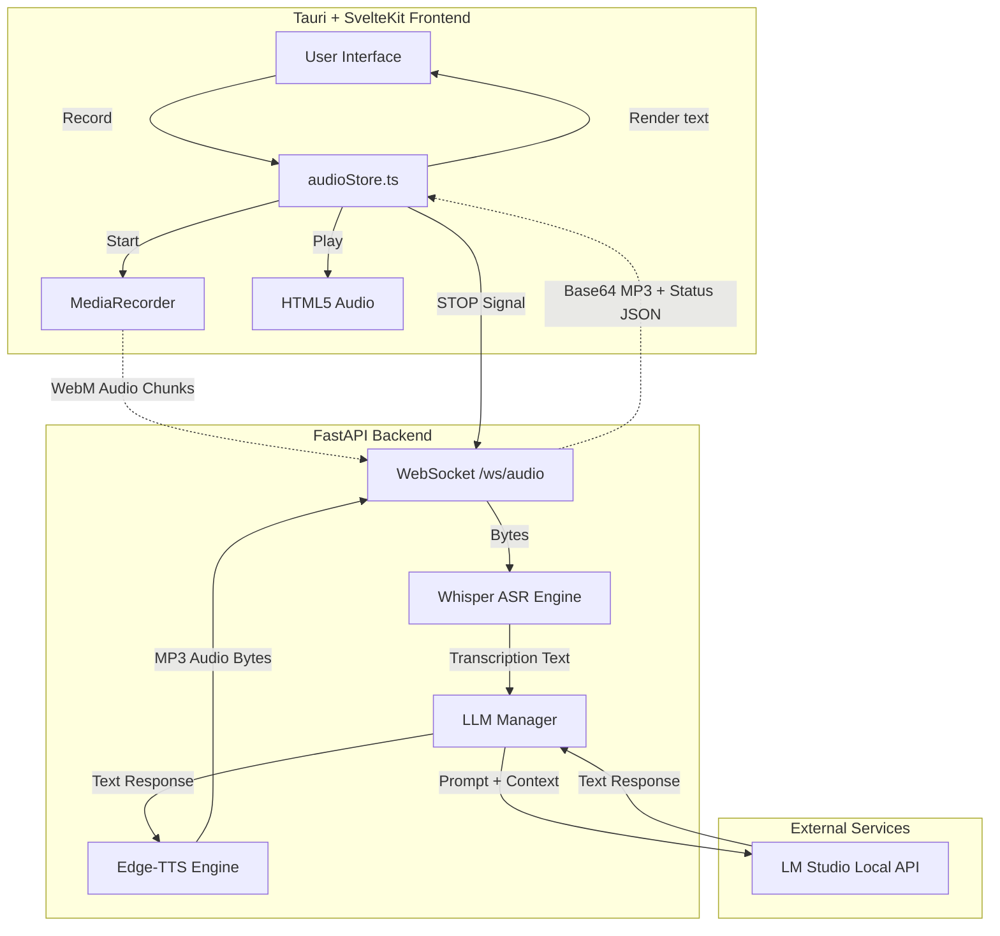
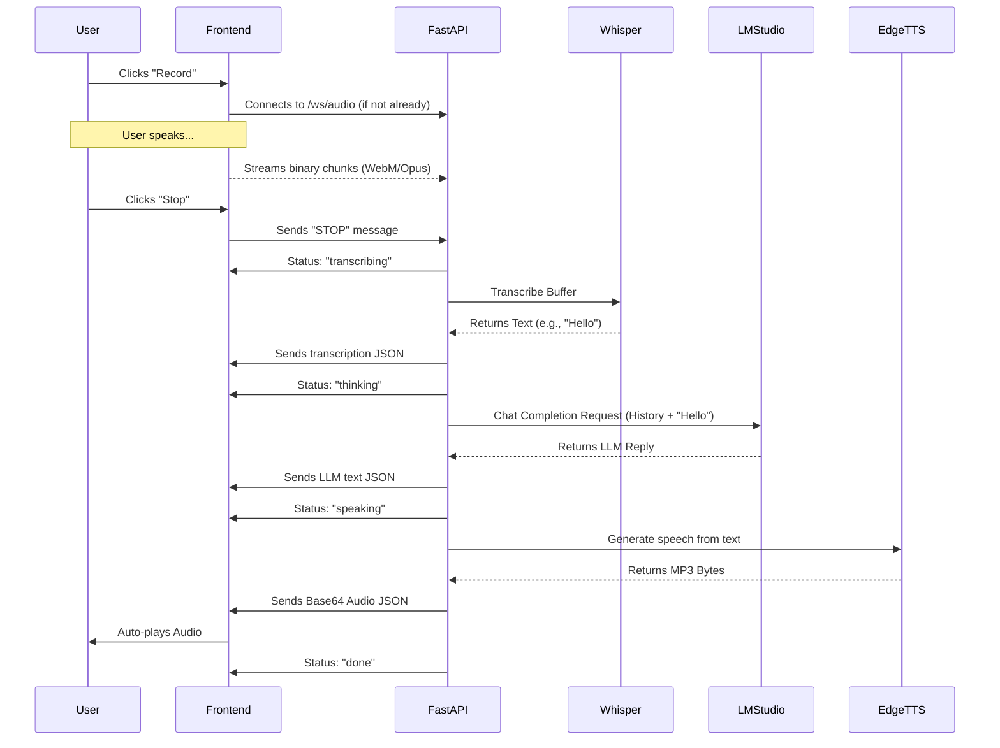

# App Architecture

English Buddy is built with a split architecture: a fast, lightweight **Tauri + SvelteKit** frontend, and a heavy-lifting **FastAPI Python** backend that processes the AI pipeline.

## High-Level System Architecture

## Conversational Pipeline Flow

This diagram illustrates the timing and status updates during a single conversational turn.

