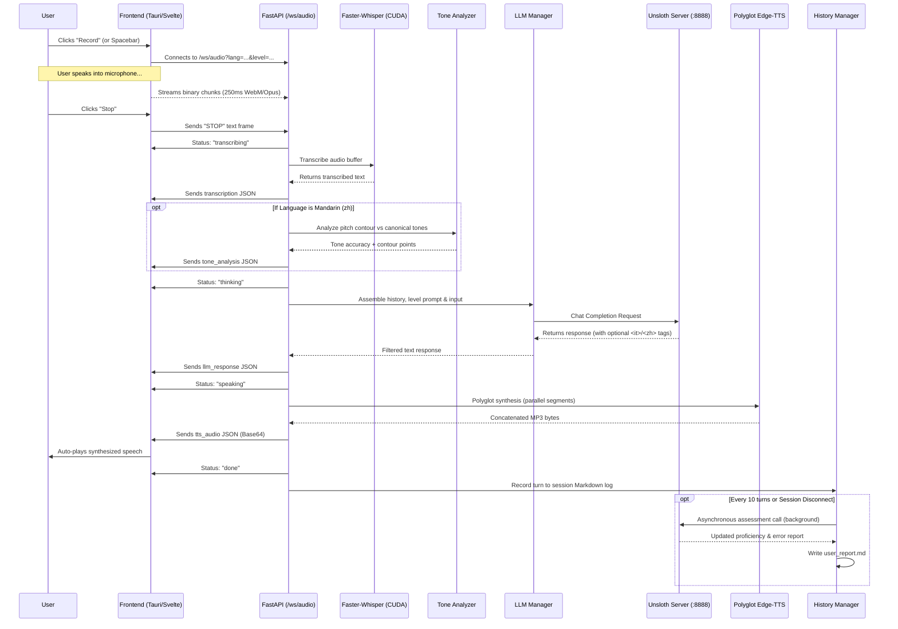

# App Architecture

English Buddy is built with a split architecture: a fast, lightweight **Tauri + SvelteKit** desktop frontend, and a high-performance **FastAPI (Python)** backend that orchestrates the AI pipeline, real-time audio analysis, and session reporting.

## High-Level System Architecture

```mermaid
graph TD
    subgraph Frontend [Tauri + SvelteKit Desktop Client]
        UI[User Interface - SvelteKit & Tailwind]
        AudioStore[audioStore.ts - Svelte Store]
        Recorder[MediaRecorder - 250ms chunks]
        Player[HTML5 Audio Player]
        TTSStudio[TTS Studio Component]
    end

    subgraph Backend [FastAPI Backend Server]
        WS[WebSocket /ws/audio]
        REST[REST API /api/tts/generate]
        ASR[Faster-Whisper CUDA Engine]
        ToneAnalyzer[Tone & Pitch Analyzer - librosa / pypinyin]
        LLM[LLM Manager]
        TTS[Polyglot Edge-TTS Engine]
        History[History Manager & Progress Assessor]
    end

    subgraph External [Local AI Infrastructure]
        Unsloth[Unsloth Studio / Local LLM Server :8888]
    end

    UI -->|Record Audio| AudioStore
    AudioStore -->|Start Capture| Recorder
    Recorder -.->|WebM/Opus Chunks (250ms)| WS
    AudioStore -->|STOP Signal| WS

    WS -->|Buffered Audio| ASR
    ASR -->|Transcription| ToneAnalyzer
    ASR -->|Transcription| LLM
    ToneAnalyzer -.->|Tones & Contour JSON| WS
    LLM -->|Chat Request + System Prompt| Unsloth
    Unsloth -->|Generated Reply| LLM
    LLM -->|Parsed Bilingual Text| TTS
    TTS -->|MP3 Audio Stream| WS

    WS -.->|Base64 MP3 + Status JSON| AudioStore
    AudioStore -->|Play Audio| Player
    AudioStore -->|Render Feedback & Chat| UI

    TTSStudio -->|POST Generate Request| REST
    REST -->|Synthesize HD Audio| TTS
    REST -.->|Base64 MP3 + Meta| TTSStudio

    WS -.->|Background Turn Log| History
    History -.->|Periodic & Close Assessment| Unsloth
```

## Conversational Pipeline Flow

The sequence diagram below illustrates the exact lifecycle of a conversational turn across client, backend, and neural pipelines.

```mermaid
sequenceDiagram
    participant User
    participant Frontend as Frontend (Tauri/Svelte)
    participant FastAPI as FastAPI (/ws/audio)
    participant Whisper as Faster-Whisper (CUDA)
    participant Tone as Tone Analyzer
    participant LLM as LLM Manager
    participant Unsloth as Unsloth Server (:8888)
    participant TTS as Polyglot Edge-TTS
    participant History as History Manager

    User->>Frontend: Clicks "Record" (or Spacebar)
    Frontend->>FastAPI: Connects to /ws/audio?lang=...&level=...
    Note over User,Frontend: User speaks into microphone...
    Frontend-->>FastAPI: Streams binary chunks (250ms WebM/Opus)
    User->>Frontend: Clicks "Stop"
    Frontend->>FastAPI: Sends "STOP" text frame
    FastAPI->>Frontend: Status: "transcribing"
    
    FastAPI->>Whisper: Transcribe audio buffer
    Whisper-->>FastAPI: Returns transcribed text
    FastAPI->>Frontend: Sends transcription JSON

    opt If Language is Mandarin (zh)
        FastAPI->>Tone: Analyze pitch contour vs canonical tones
        Tone-->>FastAPI: Tone accuracy + contour points
        FastAPI->>Frontend: Sends tone_analysis JSON
    end

    FastAPI->>Frontend: Status: "thinking"
    FastAPI->>LLM: Assemble history, level prompt & input
    LLM->>Unsloth: Chat Completion Request
    Unsloth-->>LLM: Returns response (with optional <it>/<zh> tags)
    LLM-->>FastAPI: Filtered text response
    FastAPI->>Frontend: Sends llm_response JSON
    
    FastAPI->>Frontend: Status: "speaking"
    FastAPI->>TTS: Polyglot synthesis (parallel segments)
    TTS-->>FastAPI: Concatenated MP3 bytes
    
    FastAPI->>Frontend: Sends tts_audio JSON (Base64)
    Frontend->>User: Auto-plays synthesized speech
    FastAPI->>Frontend: Status: "done"

    FastAPI->>History: Record turn to session Markdown log
    opt Every 10 turns or Session Disconnect
        History->>Unsloth: Asynchronous assessment call (background)
        Unsloth-->>History: Updated proficiency & error report
        History->>History: Write user_report.md
    end
```
